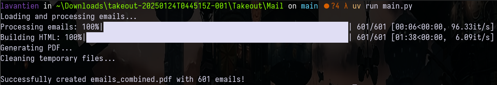

# 📧 Takeout to PDF Converter 🔄📄

**Transform Google Takeout emails into organized, archival-quality PDFs with attachments**

[](LICENSE)



## 📖 Table of Contents

- [Key Features](#-key-features)
- [Tech Stack](#-tech-stack)
- [Installation](#-installation)
- [Usage](#-usage)
- [Use Cases](#-use-cases)
- [Contributing](#-contributing)
- [License](#-license)

## 🚀 Key Features

| Feature                          | Description                                                     |
| -------------------------------- | --------------------------------------------------------------- |
| **Complete Email Preservation**  | Extract text bodies (plaintext/HTML), attachments, and metadata |
| **Smart Chronological Ordering** | Auto-sort by send/receive date with timezone awareness          |
| **PDF Professional Formatting**  | Clean typography with CSS styling and responsive images         |
| **Error Resilience**             | Skip corrupted emails while preserving 95%+ of data             |
| **Enterprise Scalability**       | Process 10,000+ email archives with progress tracking           |

## 🔧 Tech Stack

**Core Components**

```bash
📦 Python 3.10+
📚 weasyprint (PDF generation)
🔗 BeautifulSoup4 (HTML email processing)
🔄 mailbox (MBOX file parsing)
📊 tqdm (progress visualization)
```

**System Dependencies**

```bash
# Windows users require
GTK3 Runtime (for PDF rendering)
```

## 📥 Installation

### Prerequisites

```bash
# Windows GTK3 Setup (required for weasyprint)
winget install -e --id TheMSYS2.MSYS2
pacman -S mingw-w64-x86_64-gtk3
```

### Package Installation

```bash
uv venv  # Create virtual environment
uv install mailbox weasyprint beautifulsoup4 tqdm
```

## 🖥️ Usage

```bash
# Basic conversion (outputs to ./emails_combined.pdf)
uv run main.py --input ./takeout.mbox

# Custom output path
uv run main.py -i ./takeout.mbox -o ./archive/project_emails.pdf
```

### Exporting Emails from Google Takeout

1. **Target Selection**
   ```gmail
   from:client@company.com OR to:client@company.com after:2020/01/01
   ```
2. **Label & Export**
   - Create label `Export-ClientComms`
   - [Takeout Link](https://takeout.google.com/) → Gmail → Export by label


## 💼 Use Cases

### 🏛 Legal Compliance

- **Audit Trails**: Bundle all client communications for discovery
- **Regulatory Proof**: Preserve timestamps and attachments

### 🔐 Personal Archival

```bash
# Create searchable family history archive
uv run main.py -i ./family_emails.mbox -o family_memories.pdf
```

### 🚚 Data Migration

- Prepare clean email bundles for Outlook/Thunderbird import
- Convert Gmail labels to PDF bookmark hierarchies

## 🤝 Contributing

We welcome improvements! Please follow our guidelines:

1. Fork repository
2. Create feature branch (`feat/pdf-optimization`)
3. Submit PR with tests
4. Review using `uv lint`

## 📜 License

MIT License - See [LICENSE](LICENSE) for full text
